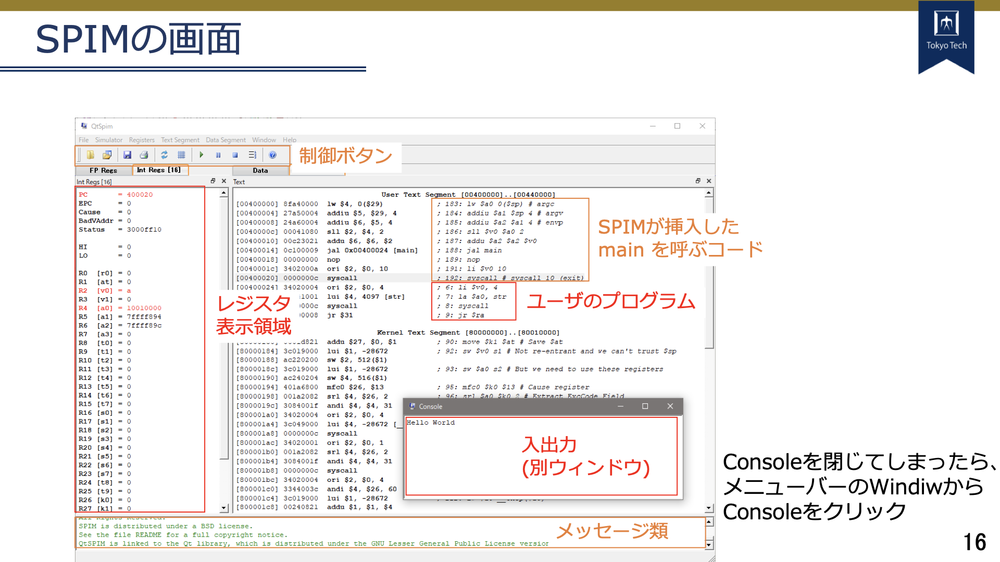
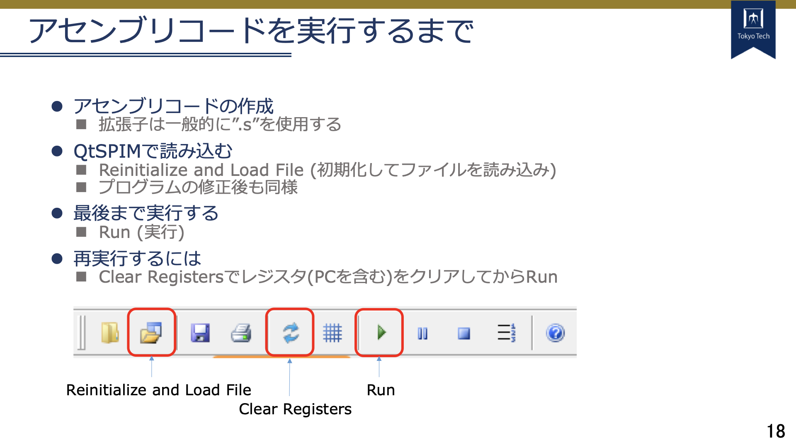
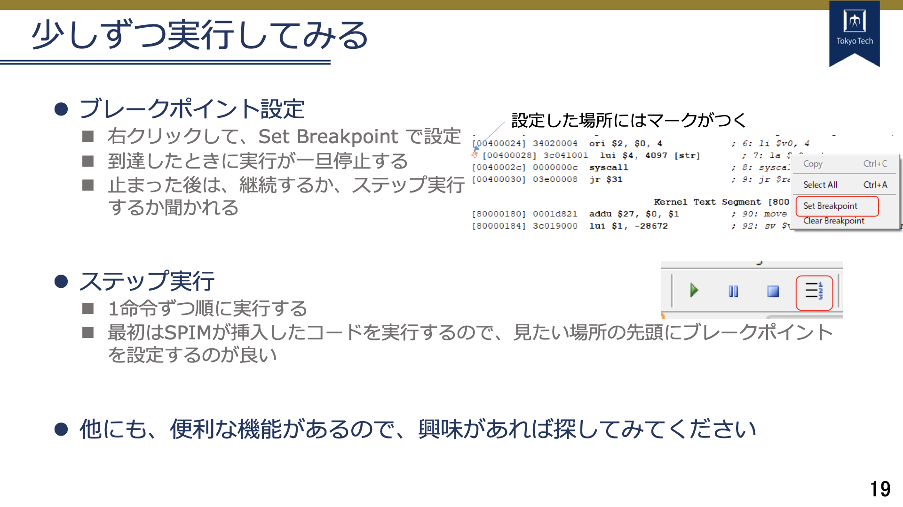

# mips_sample

## 目次

[MIPS命令セット一覧](#mips)  
[QtSPIMの使い方](#qtspim)  

## MIPS命令セット一覧

T2SCHOLAの資料を参照

## QtSPIMの使い方

### インストール

西七号館演習室マシンを使用する方はすでにインストールされています  
その他の環境で実行される場合は、[こちら](#link)に掲載したリンクからインストールしてください

### 画面の説明

### プログラムの実行

## リンク

https://spimsimulator.sourceforge.net/
